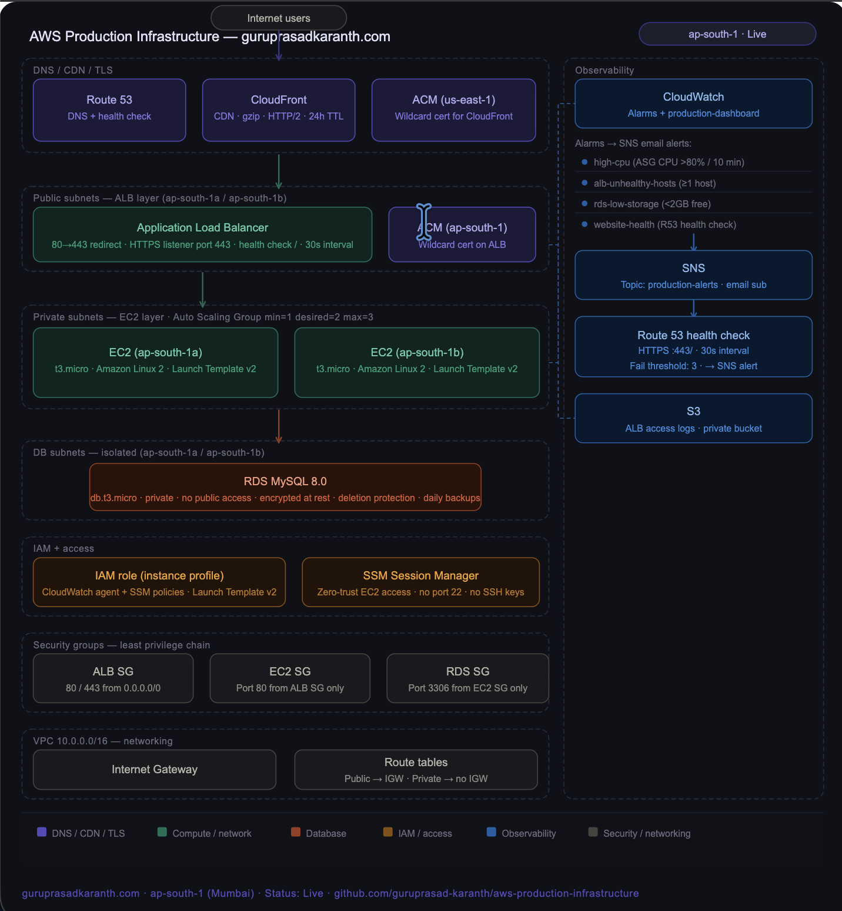

# Production-Grade AWS Infrastructure

A fully deployed, highly available cloud infrastructure on AWS — built hands-on from scratch across production environments without any guided tutorials.

**Live URL:** https://guruprasadkaranth.com
**Region:** ap-south-1 (Mumbai) | **AZs:** 2 | **Status:** Live

---

## Architecture

---

## Infrastructure Overview

| Layer | Service | Details |
|---|---|---|
| DNS | Route53 | Custom domain, alias A records, endpoint health checks |
| CDN | CloudFront | Global edge caching, TLSv1.2, HTTP/2, HTTP→HTTPS |
| SSL | ACM | Wildcard certificate (*.guruprasadkaranth.com), DNS validation |
| Load Balancer | ALB | HTTPS listener, HTTP→HTTPS redirect, health checks every 30s |
| Compute | EC2 + Auto Scaling | t3.micro across 2 AZs, min=1, desired=2, max=3 |
| Database | RDS MySQL 8.0 | Private DB subnets, deletion protection, automated backups |
| Networking | VPC | Public, private, and DB subnets across 2 AZs |
| Security | Security Groups | Least-privilege inbound/outbound rules per layer |
| Identity | IAM | EC2 instance profile, CloudWatch + SSM least-privilege policies |
| Observability | CloudWatch | Alarms, dashboard, SNS alerting, Route53 health checks |
| Access | SSM Session Manager | Zero-trust EC2 access — no open SSH port 22 |
| Logging | S3 | ALB access logs stored in private S3 bucket |

---

## What Was Built

### Networking (VPC)
- Custom VPC (10.0.0.0/16) with 6 subnets across 2 AZs — public (ALB), private (EC2), isolated DB (RDS)
- Internet Gateway for public traffic; private subnets have no direct internet access
- Security Groups enforce least-privilege: ALB accepts 80/443, EC2 only from ALB, RDS only from EC2

### Compute (EC2 + Auto Scaling)
- Launch Template with Amazon Linux 2, t3.micro, user data script installs and starts web server on boot
- Auto Scaling Group (min=1, desired=2, max=3) across 2 AZs with scale-out and scale-in policies
- New instances automatically get IAM instance profile and security group — no manual intervention

### Load Balancing (ALB)
- Application Load Balancer in public subnets distributing traffic across EC2 instances
- HTTP listener redirects all port 80 traffic to HTTPS (301 redirect)
- HTTPS listener on port 443 terminates SSL and forwards to target group
- Health checks every 30 seconds ensuring only healthy instances receive traffic

### SSL/TLS (ACM)
- Wildcard certificate (*.guruprasadkaranth.com) via AWS Certificate Manager
- DNS validation via Route53 CNAME records — auto-renewed without manual intervention
- Separate certificate in us-east-1 for CloudFront (required by AWS)

### DNS (Route53)
- Hosted zone for guruprasadkaranth.com with alias A record pointing to CloudFront
- Nameservers migrated from Network Solutions to Route53
- Route53 health check monitoring https://guruprasadkaranth.com:443/ with CloudWatch alarm

### CDN (CloudFront)
- Distribution with ALB as custom origin, HTTPS-only to origin, TLSv1.2 minimum
- HTTP/2 enabled, global edge caching with 24-hour default TTL, Gzip compression
- Domain alias guruprasadkaranth.com with ACM wildcard certificate

### Database (RDS)
- MySQL 8.0 (db.t3.micro) in private DB subnets — not publicly accessible
- Deletion protection enabled, automated daily backups, encrypted at rest
- Connected to EC2 via Security Group on port 3306 only

### IAM (Least Privilege)
- EC2 instance role with two policies: CloudWatchAgentServerPolicy and AmazonSSMManagedInstanceCore
- Attached as instance profile to Launch Template — every Auto Scaling instance gets it automatically
- No hardcoded credentials anywhere in the infrastructure

### Observability (CloudWatch)
- Three production alarms tied to SNS email alerting:
  - `high-cpu-alarm` — triggers Auto Scaling scale-out when ASG CPU exceeds 80%
  - `alb-unhealthy-hosts` — fires immediately when any target goes unhealthy
  - `rds-low-storage` — warns when RDS free storage drops below 2GB
- Production dashboard showing CPU, ALB request count, unhealthy hosts, and RDS storage in one view

### Access (SSM Session Manager)
- EC2 instances accessible via AWS Systems Manager — no SSH keys, no open port 22
- IAM role (AmazonSSMManagedInstanceCore) attached to every instance via Launch Template
- Both instances verified Online in SSM — zero-trust access confirmed

### Logging (S3 ALB Access Logs)
- Private S3 bucket (production-alb-logs) receiving ALB access logs
- Bucket policy grants ELB service account write access only
- All public access blocked — logs accessible only via AWS Console or CLI

---

## Problems Solved

| Problem | Root Cause | Fix |
|---|---|---|
| DNS propagation confusion | CNAME records added to Network Solutions ignored because Route53 nameservers already active | Added validation CNAMEs directly to Route53 |
| CloudFront certificate region mismatch | ACM certificates must be in us-east-1 for CloudFront even if infra is in ap-south-1 | Requested second certificate in us-east-1 |
| Free tier RDS Multi-AZ restriction | Multi-AZ and 7-day retention not available on free tier | Single-AZ with deletion protection deployed; design intent documented |
| Launch Template IAM propagation | Existing EC2 had no IAM role attached | Created new Launch Template version v2 with instance profile; updated ASG to use it |

---

## Skills Demonstrated

`AWS` `EC2` `VPC` `ALB` `Auto Scaling` `Route53` `CloudFront` `RDS` `ACM` `IAM` `CloudWatch` `SNS` `SSM` `S3` `Security Groups` `Linux` `DNS` `SSL/TLS` `HTTPS` `High Availability` `Observability` `Zero-Trust Access` `Cost Management`
